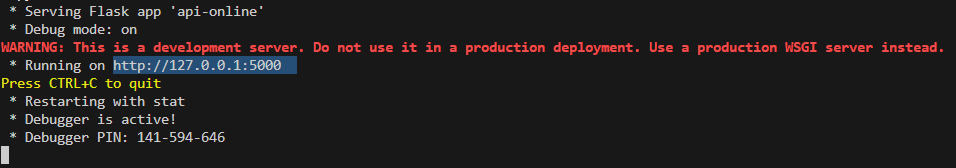
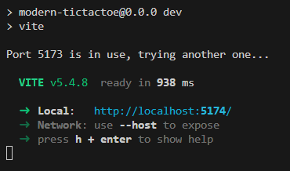

Welcome, student! This guide will help you set up the website and implement your Minimax algorithm correctly.
first you should run the server code in your local host using, how?
    1) go to projectName/API/api-online.py and run the code
    2) when you run it the terminal appears and and display the same like this picture 
    3) if the IP or the port is different that the picture so change it in this file: .../src/store/gameStore/   5:20
    4) setup to run the web site on our local device you should have node.js to use npm command, 
        install flask => (pip install flask)
        install flask_cors => (pip install flask_cors)
        install required packages => (npm install)
    5) run the following command to build the website (you should open new terminal) => (npm run dev), that should display like this : , congratulations, you have now the web site hosted on you local device, click ctrl+(click the link) to open it in your browser 

warning: powerShell doesn't support npm command so i recommend you to use Command Prompt